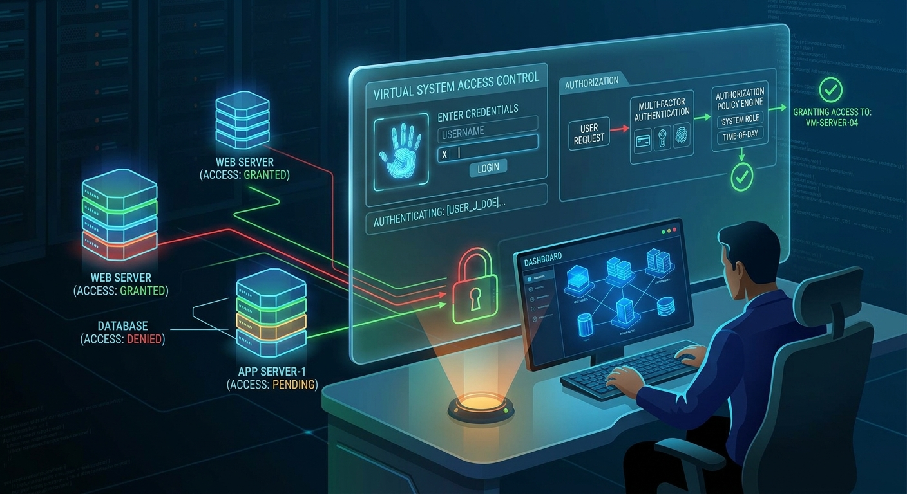

## Application Interface



# 🔐 Remote Access Management System

A secure, centralized **Remote Access Management System** developed with **Python, Tkinter, and MySQL** to manage users, devices, access requests, permissions, and authorized remote sessions.

The system is designed to provide organizations with better visibility and control over who is authorized to access company devices and when that access is permitted. It provides an approval workflow and maintains records of remote sessions for accountability and auditing.

---

## 📌 Project Overview

The **Remote Access Management System (RAMS)** is a desktop-based application designed to help IT departments securely manage remote-access activities within an organization.

Instead of allowing remote access to be handled informally, the system provides a structured process:

**User → Access Request → Approval → Authorized Session → Session Termination → Audit Record**

The application provides administrators and IT personnel with tools to manage:

* 👤 Users and roles
* 💻 Organizational devices
* 🔑 Access permissions
* 📋 Remote access requests
* 🖥️ Authorized remote sessions
* 📝 Session history and auditing
* 🔒 Access status and authorization controls

> **Important:** The application manages authorization, access requests, and session records. Actual RDP, SSH, VPN, VNC, or other remote connections should be performed through the organization's approved remote-access client, gateway, or infrastructure.

---

## 🎯 Objectives

The primary objectives of the system are to:

1. Centralize remote-access management.
2. Control access to organizational devices.
3. Implement an approval-based access workflow.
4. Maintain records of authorized remote sessions.
5. Improve accountability for remote-access activities.
6. Reduce unauthorized access risks.
7. Provide an auditable record of access requests and sessions.
8. Provide a foundation for integrating approved remote-access infrastructure.

---

## ✨ Key Features

### 👤 User Management

Administrators can manage application users and their account status.

Supported roles include:

* Administrator
* IT Manager
* Technician
* Viewer

User information can include:

* Username
* Full name
* Email address
* Password hash
* Role
* Account status
* Account creation date
* Last login

---

### 💻 Device Management

The system maintains information about devices that may be accessed remotely.

Device records can include:

* Device name
* Hostname
* IP address
* Operating system
* Device type
* Location
* Device owner
* Device status

Supported device states include:

* `ONLINE`
* `OFFLINE`
* `MAINTENANCE`

---

### 📋 Access Request Management

Users can submit requests to access authorized devices.

An access request contains information such as:

* Requester
* Target device
* Reason for access
* Requested date/time
* Start time
* End time
* Approval status
* Approving user
* Approval timestamp

Request statuses include:

```text
PENDING
APPROVED
REJECTED
EXPIRED
CANCELLED
```

Only approved requests should be used to initiate an authorized remote session.

---

### 🔑 Permission Management

The permission module provides controlled access between users and devices.

Supported access types include:

```text
RDP
SSH
VNC
VPN
Web
Other
```

Permissions can also be:

```text
ACTIVE
REVOKED
EXPIRED
```

---

### 🖥️ Remote Session Management

The system records authorized remote sessions.

Each session can contain:

* Session ID
* Access Request ID
* User
* Device
* Protocol
* Start time
* End time
* Session status

Session states include:

```text
STARTED
ENDED
```

This provides an audit trail of when authorized remote sessions were initiated and terminated.

---

## 🔄 Access Workflow

The application follows an authorization workflow:

```text
┌───────────────┐
│     User      │
└───────┬───────┘
        │
        ▼
┌────────────────────┐
│ Submit Access      │
│ Request            │
└────────┬───────────┘
         │
         ▼
┌────────────────────┐
│ Administrator /    │
│ IT Manager Review  │
└────────┬───────────┘
         │
      ┌──┴───┐
      │      │
      ▼      ▼
   APPROVE  REJECT
      │
      ▼
┌────────────────────┐
│ Authorized Remote  │
│ Session            │
└────────┬───────────┘
         │
         ▼
┌────────────────────┐
│ Session Ends       │
└────────┬───────────┘
         │
         ▼
┌────────────────────┐
│ Audit / Session    │
│ Record              │
└────────────────────┘
```

---

## 🏗️ System Architecture

The system uses a three-layer architecture:

```text
┌───────────────────────────────────────┐
│          Tkinter Desktop UI          │
│       Python Application Interface   │
└──────────────────┬────────────────────┘
                   │
                   ▼
┌───────────────────────────────────────┐
│          Application Layer            │
│                                       │
│ Authentication                        │
│ User Management                       │
│ Device Management                     │
│ Access Requests                       │
│ Permissions                           │
│ Remote Sessions                       │
└──────────────────┬────────────────────┘
                   │
                   ▼
┌───────────────────────────────────────┐
│              MySQL Database           │
│                                       │
│ users                                 │
│ devices                               │
│ permissions                           │
│ access_requests                       │
│ remote_sessions                       │
└───────────────────────────────────────┘
```

---

## 🛠️ Technologies Used

| Technology                 | Purpose                             |
| -------------------------- | ----------------------------------- |
| **Python 3**               | Application development             |
| **Tkinter**                | Desktop graphical user interface    |
| **MySQL**                  | Database management                 |
| **mysql-connector-python** | Python/MySQL connectivity           |
| **bcrypt**                 | Password hashing                    |
| **PyCharm**                | Development environment             |
| **PyInstaller**            | Application packaging               |
| **Inno Setup**             | Windows installation package        |
| **Git/GitHub**             | Version control and project hosting |

---

## 🗄️ Database Structure

The system uses the following major database tables:

### `users`

Stores application users and authentication information.

### `devices`

Stores organizational devices that can be subject to remote-access requests.

### `permissions`

Stores user-to-device access permissions.

### `access_requests`

Stores requests for remote access and their approval status.

### `remote_sessions`

Stores authorized remote-session records.

The primary relationships are:

```text
users
  │
  ├──────────────┐
  │              │
  ▼              ▼
permissions   access_requests
                   │
                   ▼
                devices
                   │
                   ▼
             remote_sessions
```

---

## 🔒 Security Features

Security was considered throughout the design of the application.

### Password Protection

User passwords should never be stored as plain text.

The system uses password hashing, such as:

```text
bcrypt
```

### Role-Based Access

Different users can be assigned different roles, allowing application functionality to be controlled according to responsibility.

### Approval-Based Access

A remote session should only be created from an approved access request.

### Database Separation

The deployed application should use a dedicated MySQL application account instead of the MySQL `root` account.

Example:

```sql
CREATE USER
'remote_app'@'localhost'
IDENTIFIED BY 'StrongPasswordHere';
```

The application account should receive only the database privileges required by the application.

### Session Auditing

Remote sessions record:

* Who initiated the session
* Which device was accessed
* Which protocol was authorized
* When the session started
* When the session ended
* The current session status

---

## 📁 Project Structure

A typical project structure is:

```text
RemoteAccessManagementSystem/
│
├── main.py
├── login.py
├── dashboard.py
├── database.py
├── users.py
├── devices.py
├── permissions.py
├── access_requests.py
├── sessions.py
│
├── requirements.txt
├── README.md
├── .gitignore
│
├── assets/
│   └── ...
│
├── build/
│
└── dist/
```

> The exact filenames may differ depending on the final project structure.

---

## ⚙️ Installation

### 1. Clone the Repository

```bash
git clone https://github.com/YOUR-USERNAME/RemoteAccessManagementSystem.git
```

Navigate into the project:

```bash
cd RemoteAccessManagementSystem
```

---

### 2. Create a Virtual Environment

On Windows:

```powershell
python -m venv .venv
```

Activate it:

```powershell
.venv\Scripts\activate
```

---

### 3. Install Dependencies

```powershell
pip install -r requirements.txt
```

---

## 🗄️ MySQL Configuration

Open **MySQL Workbench** and create the database:

```sql
CREATE DATABASE IF NOT EXISTS remote_access_management
CHARACTER SET utf8mb4
COLLATE utf8mb4_unicode_ci;

USE remote_access_management;
```

Create the required tables using the SQL scripts provided with the project.

The application should then be configured to connect to:

```text
Database: remote_access_management
Host: localhost
Port: 3306
```

---

## 🔐 Database Configuration

For development, database credentials may be configured through environment variables.

Example:

```text
DB_HOST=localhost
DB_PORT=3306
DB_USER=remote_app
DB_PASSWORD=your_database_password
DB_NAME=remote_access_management
```

Do **not** commit real passwords, API keys, or other credentials to GitHub.

---

## ▶️ Running the Application

Activate the virtual environment:

```powershell
.venv\Scripts\activate
```

Run the application:

```powershell
python main.py
```

The login window should appear.

After successful authentication, the user can access the modules permitted by their role.

---

## 🖥️ Main Application Modules

The system can provide a dashboard containing modules such as:

```text
┌─────────────────────────────────────┐
│     REMOTE ACCESS MANAGEMENT        │
├─────────────────────────────────────┤
│                                     │
│  👤 Users                           │
│  💻 Devices                         │
│  🔑 Permissions                     │
│  📋 Access Requests                 │
│  🖥️ Remote Sessions                │
│                                     │
│  Logout                             │
└─────────────────────────────────────┘
```

---

## 📊 Remote Session Management

The Remote Sessions module provides a centralized view of recorded sessions.

Example information displayed:

| ID | User       | Device    | Protocol | Started | Ended | Status  |
| -- | ---------- | --------- | -------- | ------- | ----- | ------- |
| 1  | admin      | Server-01 | RDP      | 10:15   | 10:45 | ENDED   |
| 2  | technician | PC-05     | SSH      | 11:00   | —     | STARTED |

The **Start Authorized Session** function validates the associated access request before recording the session.

The **End Session** function records the termination time and changes the status to:

```text
ENDED
```

---

## 📦 Windows Deployment

The application can be packaged using **PyInstaller**.

Example:

```powershell
pyinstaller --onedir --name RemoteAccessManagementSystem main.py
```

The generated application will be placed inside:

```text
dist/
```

The resulting application can then be packaged into a Windows installer using **Inno Setup**.

---

## 🔧 Troubleshooting

### MySQL Connection Error

Check:

* MySQL Server is running.
* Database name is correct.
* Username and password are correct.
* Port `3306` is available.
* The application database user has the required privileges.

### Table/Column Errors

Verify the database structure:

```sql
USE remote_access_management;

SHOW TABLES;
```

For a specific table:

```sql
DESCRIBE remote_sessions;
```

Or:

```sql
SHOW CREATE TABLE remote_sessions;
```

The Python application and MySQL database schema must use matching table and column names.

---

## 🚀 Future Enhancements

Potential future versions may include:

* 🔐 Multi-factor authentication
* 📧 Email notifications for access requests
* 📱 Mobile approval interface
* 📊 Advanced security dashboards
* 📈 Access analytics
* 📝 Comprehensive audit logs
* 🔔 Real-time notifications
* ⏰ Automatic permission expiration
* 🔗 Integration with approved RDP/SSH/VPN gateways
* 🛡️ Active Directory / LDAP integration
* 🌐 Centralized web administration portal
* 🚨 Security-event monitoring
* 📑 Automated compliance reports

---

## 🎓 Project Use Cases

The Remote Access Management System can be used as a foundation for:

* IT department remote-access administration
* Enterprise device-access management
* Help-desk authorization workflows
* Network administration
* Cybersecurity demonstrations
* Access-control research
* Academic software engineering projects
* Security operations prototypes

---

## 🔐 Security Disclaimer

This project is intended for **authorized organizational, educational, and development environments**.

The system is designed to manage authorization and record remote-access sessions. It should not be used to obtain unauthorized access to computers, networks, accounts, or systems.

Actual remote connections should be performed through properly configured and approved organizational infrastructure.

---

## 📸 Screenshots

Screenshots can be added to this section after deployment.

Recommended screenshots include:

```text
screenshots/
├── login.png
├── dashboard.png
├── users.png
├── devices.png
├── access_requests.png
├── permissions.png
└── remote_sessions.png
```

Example Markdown:

```markdown
(screenshots/login.png)


(screenshots/dashboard.png)

(screenshots/remote_sessions.png)
```

---

## 📌 Project Status

**Status:** Active Development

The core system provides the foundation for:

* User management
* Device management
* Permission management

* Access-request approval
* Authorized session recording
* MySQL database integration
* Windows application deployment

Additional enterprise security and remote-access integrations can be added in future releases.

---

## 👨‍💻 Author

**Project:** Remote Access Management System

**Technologies:** Python • Tkinter • MySQL • PyCharm • PyInstaller • Inno Setup

Design by:
Matthew Damola Ojelere (Dwise)

---

## ⭐ Contributing

Contributions, suggestions, bug reports, and improvements are welcome.

Before submitting changes:

1. Create a new branch.
2. Make your changes.
3. Test the application.
4. Verify the MySQL database integration.
5. Commit your changes.
6. Submit a pull request.

---

## ⭐ Project Summary

**Remote Access Management System** provides a structured approach to controlling and auditing remote-access requests within an organization.

By combining **Python/Tkinter**, **MySQL**, role-based access, approval workflows, permission management, and session tracking, the system provides a foundation for secure and accountable remote-access administration.

```text
REQUEST
   ↓
APPROVAL
   ↓
AUTHORIZATION
   ↓
REMOTE SESSION
   ↓
SESSION TERMINATION
   ↓
AUDIT RECORD
```

**Secure Access • Controlled Authorization • Auditable Sessions**
